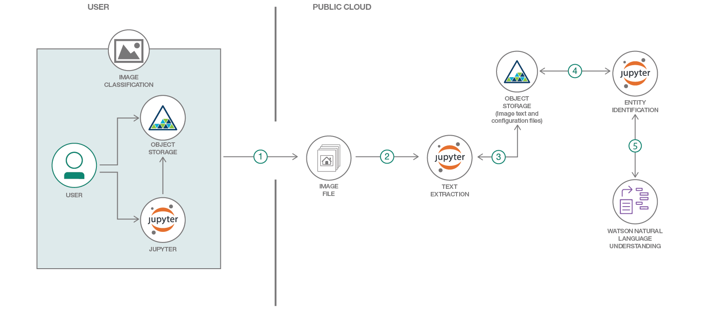
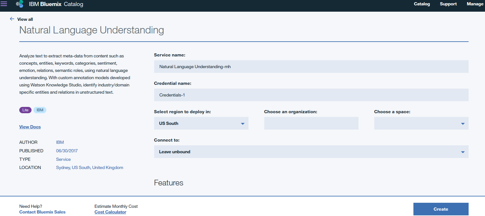
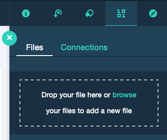
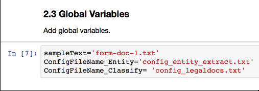

# Identify information in document images - A composite code pattern

This is a composite code pattern which will cover methodology for recognising images and identifying information from document images. [Part1](https://github.com/IBM/image-classification-using-cnn-and-keras) of this composite code pattern deals with classifying images. This code pattern is part2 of the composite code pattern.

Let us recap the use case described in [Part1](https://github.com/IBM/image-classification-using-cnn-and-keras). We considered use cases where application forms are submitted along with supporting documents. Specifically let's take rental agreements and purchase agreements. Application forms for these agreements require supporting documents such as driving license, passport, cheque leaf, pancard. All these documents, along with filled application forms, are digitally scanned and stored. To process the applications further, these documents should be recognised, classified and relevant information retrieved from application forms. Processing this manually is cumbersome and error prone. This code pattern provides methodology for extraction and identification of information, from scanned images, by processing systems.

This code pattern covers the following aspects:
* Classify images so as to separate out the application form documents, covered in [Part1](https://github.com/IBM/image-classification-using-cnn-and-keras)
* Text extraction from application form documents
* Identification of entities (information) from application form documents and also determine what the application is the form for, using configuration files. Entity configuration files are explained in this [code pattern](https://github.com/IBM/watson-document-classifier)

After completing this pattern, you will learn how to:

* Extract text using Optical Character Recognition
* Use the IBM Watson NLU API to extract entities from documents using Jupyter notebooks.
* Use a configuration file to build configurable and layered classification grammar.
* Use the combination of grammatical classification and regex patterns from a configuration file to extract information.

We will use Python, Jupyter notebook, Python NLTK, Watson Natural Language Understanding service and IBM Cloud Object Storage

## Flow

1. [code pattern](https://github.com/IBM/image-classification-using-cnn-and-keras) identifies application form document image
2. Text from image is extracted by running Python code in Jupyter notebook in Watson Studio
3. Extracted text is stored in Object Storage
4. Python code running in Jupyter notebook pulls text from Object Storage
5. Entities are extracted from text using Watson Natural Language Understanding service

## Included components

* [IBM Watson Studio](https://console.bluemix.net/catalog/services/watson-studio): Analyze data using RStudio, Jupyter, and Python in a configured, collaborative environment that includes IBM value-adds, such as managed Spark.

* [IBM Cloud Object Storage](https://console.bluemix.net/catalog/infrastructure/cloud-object-storage): An IBM Cloud service that provides an unstructured cloud data store to build and deliver cost effective apps and services with high reliability and fast speed to market.

* [Watson Natural Language Understanding](https://console.bluemix.net/catalog/services/natural-language-understanding/?cm_sp=dw-bluemix-_-code-_-devcenter): A IBM Cloud service that can analyze text to extract meta-data from content such as concepts, entities, keywords, categories, sentiment, emotion, relations, semantic roles, using natural language understanding.

## Featured technologies

* [Jupyter Notebooks](http://jupyter.org/): An open-source web application that allows you to create and share documents that contain live code, equations, visualizations and explanatory text.
* [Artificial Intelligence](https://www.computerworld.com/article/2906336/emerging-technology/what-is-artificial-intelligence.html): Intelligence demonstrated by machines, in contrast to the natural intelligence displayed by humans.
* [Machine Learning](https://searchenterpriseai.techtarget.com/definition/machine-learning-ML): Uses statistical techniques to give computer systems the ability to "learn" with data
* [Natural Language Processing](https://machinelearningmastery.com/natural-language-processing/): the ability of a computer program to understand human language as it is spoken. NLP is a component of Artificial Intelligence
* [Python](https://www.python.org/): An interpreted high-level programming language for general-purpose programming

# Steps
Follow these steps to setup and run this developer journey. The steps are described in detail below.
1. [Sign up for IBM Watson Studio](#1-sign-up-for-ibm-watson-studio)
2. [Classification of image Documents](#2-classification-of-image-documents)
3. [Text Extraction Using Optical Character Recognition](#3-text-extraction-using-optical-character-recognition)
4. [Entity Extraction and Document Classification](#4-entity-extraction-and-document-classification)
5. [Analyze the Results](#5-analyze-the-results)

## 1. Sign up for IBM Watson Studio

If you have not already signed up for Watson Studio then you can sign up [here](https://console.bluemix.net/catalog/services/watson-studio). By signing up for IBM Watson Studio, two services will be created - ``Spark`` and ``ObjectStore`` in your IBM Cloud account.

## 2. Classification of image documents
Classify images using [Image Classification Using CNN and Keras](https://github.com/IBM/image-classification-using-cnn-and-keras). This will identify the image with application form. This document will be used for text extraction in the below section

## 3. Text Extraction Using Optical Character Recognition

[Previous section](#2-classification-of-image-documents) identified application form document among the list of all image documents. This section extracts text from the application form document that was identified in the above section. The text is then saved as text document on to Object Storage.

We will use tesseract OCR for text extraction. We need to install tesseract engine on our local machine. And so we will run the next notebook on local.  
* [Install Tesseract OCR](https://github.com/tesseract-ocr/tesseract/wiki). Follow the instructions according to your system specifications
* To run the notebook locally, we will install Jupyter notebook on local. Refer [this link](http://jupyter.readthedocs.io/en/latest/install.html) for Jupyter installation instructions
* Download `Convert_Image_to_Text.ipynb` from repo https://github.com/IBM/image-recognition-and-information-extraction-from-image-documents/blob/master/notebooks/ and open it in Jupyter notebook on local machine
* In the notebook, under section 2.1, update the path of the form document. The form document was identified by the previous notebook run.

Create a file named `credentials.json` and save it anywhere on local machine, say on desktop. This will be a placeholder for cloud object storage bucket credentials. To get the credentials, go to your Cloud Object Storage instance on IBM Cloud dashboard and click on `Service Credentials`. In the desired bucket relevant to your project on Watson Studio, click on `View Credentials`

Click on `Copy to Clipboard` icon on the right to copy credentials. Paste the contents in `credentials.json` file.

Update the path of `credentials.json` file in `2.2 Connect to Object Storage` of notebook

Run the notebook by clicking on `Cell`>`Run all` in the menu bar.

* The output of this section will be text content of image document, which will be saved to Object Storage as `form-doc-x.txt`, where x is the nth document. e,g, if it's first form document the file is stored as `form-doc-1.txt`. This file will be used later by another notebook to extract information from text extracted.

## 4. Entity Extraction and Document Classification

### 4.1 Create IBM Cloud services

Create the following IBM Cloud service and give a unique name for the service:

* [Watson Natural Language Understanding](https://console.bluemix.net/catalog/services/natural-language-understanding)

### 4.2 Create notebook

Login to [IBM Cloud Dashboard](http://console.bluemix.net/). Click on the Watson Studio instance that was created earlier. Click `Get Started` button at the bottom of the page.

* Under `Projects`, select the project
* Click on `Assets` tab. Navigate to `Notebooks` section below. Click `Create Notebook`
* Select the `From URL` tab.
* Enter a name for the notebook.
* Optionally, enter a description for the notebook.
* Enter this Notebook URL: https://github.com/IBM/image-recognition-and-information-extraction-from-image-documents/blob/master/notebooks/Entity%20Extraction%20and%20Document%20Classification.ipynb
* Under Runtime select Default Python with 1 CPU and 4GB RAM
* Click the `Create` button.

### 4.3 Upload text data and configuration data to Object Storage

There are two configuration files

#### 4.3.1 Entities Config
Check the file https://github.com/IBM/image-recognition-and-information-extraction-from-image-documents/blob/master/Configuration/config_entity_extract.txt. This file contains regular expressions and chunking patterns which are used to identify entities and their values from the text of the form document.
The configuration json file controls the way the text is classified. The classification process is divided into stages - Base Tagging and Domain Tagging. The Base Tagging stage can be used to specify keywords based classification, regular expression based classification, and tagging based on chunking expressions. The Domain Tagging stage can be used to specify classification that is specific to the domain, in order to augment the results from Watson Natural Language.

#### 4.3.2 Document Type config
Check the file https://github.com/IBM/image-recognition-and-information-extraction-from-image-documents/blob/master/Configuration/config_legaldocs.txt. This file contains information to identify the type of the document. It specifies what all entities should be available in a document to categorise the document to a particular type. E.g. A document can be a rental agreement document if it has entities `Leaser Term`, `Rent`, `Security Deposit`.

* Download `config_entity_extract.txt` and `config_legaldocs.txt` from the repo https://github.com/IBM/image-recognition-and-information-extraction-from-image-documents/tree/master/Configuration
* Add the above configuration files to Object Storage. In Watson Studio, go to your project default page, use `Find and Add Data` (look for the 10/01 icon) and its `Files` tab. Upload these files onto Cloud Storage using `browse` button

If you use your own data and configuration files, you will need to update the variables that refer to the data files in the Jupyter Notebook.

To open the notebook, click on the edit icon to start editing the notebook on your project.

In the notebook, update the global variables in the cell following

2.3 Global Variables section.

Enter the filenames of the text file obtained as a result of `Text Extraction Using Optical Character Recognition` as well as the configuration files uploaded into Object Storage.

### 4.4 Create Watson Natural Language Understanding (NLU) service
Create [Watson NLU](https://console.bluemix.net/catalog/services/natural-language-understanding) service instance if not already available

### 4.5 Add Watson NLU credentials to notebook
Get Watson NLU service credentials:
* On your IBM Cloud Dashboard, click on Watson NLU service instance. On the left hand navigation bar click `Service Credentials`
* If you see `View Credentials` under `Service Credentials` then click on the down arrow mark beside `View Credentials`. Make of note of the credentials.
* If you do not see `View Credentials`, then click `New Credential` to create new credentials and make a note of new credentials.

Select the cell below `2.1 Add your service credentials from IBM Cloud for the Watson services` section in the notebook to update `username` and `password` for Watson NLU.

### 4.6 Add Object Storage credentials to notebook
* Select the cell below `2.2 Add your service credentials for Object Storage` section in the notebook to update the credentials for Object Store.
* Delete the contents of the cell
* Use `Find and Add Data` (look for the `10/01` icon) and its `Files` tab. You should see the file names uploaded earlier. Make sure your active cell is the empty one below `2.2 Add...`
* Select `Insert to code` (below your `sample_text.txt`).
* Click `Insert Credentials` from drop down menu.
* Make sure the credentials are saved as `credentials_1`.

Run the notebook by clicking on `Cell`>`Run all` in the menu bar.

## 5. Analyse the results

This pattern aims to automate the identification of legal form document from other such documents and further extract useful information to classify the kind of legal form document it is.

1. First, we ran executed the code pattern [Image Classification using CNN and Keras](https://github.com/IBM/image-classification-using-cnn-and-keras). The model classified the images and marked the application for documents in the set of input images by providing it's path. e.g. `test_doc-external/Form1 copy 2.jpg`
2. As a second step we ran the second notebook `conv_img_to_txt.ipynb`. Here we converted image to text using tesseract and uploaded the text file to Object storage
3. As a final step we ran the notebook `Entity Extraction and Document Classification.ipynb`. This notebook used a couple of configuration files and identified required information from the text extracted in the second step above. It used Watson NLU and custom configuration to understand what information to identify based on what type of document is the text document. like, if the text is a purchase agreement, then it identifies a particular set of entities related to purchase agreement.

Entities identified from the form document are displayed as shown in below image

Document type identified is displayed as shown in below image

# Links
* [Demo on youtube - link to be added]()
* [Watson Studio](https://www.ibm.com/cloud/watson-studio)
* [Object Storage](https://www.ibm.com/cloud/object-storage)

# Learn more

* **Artificial Intelligence Code Patterns**: Enjoyed this Code Pattern? Check out our other [AI Code Patterns](https://developer.ibm.com/code/technologies/artificial-intelligence/).
* **AI and Data Code Pattern Playlist**: Bookmark our [playlist](https://www.youtube.com/playlist?list=PLzUbsvIyrNfknNewObx5N7uGZ5FKH0Fde) with all of our Code Pattern videos
* **With Watson**: Want to take your Watson app to the next level? Looking to utilize Watson Brand assets? [Join the With Watson program](https://www.ibm.com/watson/with-watson/) to leverage exclusive brand, marketing, and tech resources to amplify and accelerate your Watson embedded commercial solution.

# License

[Apache 2.0](LICENSE)
